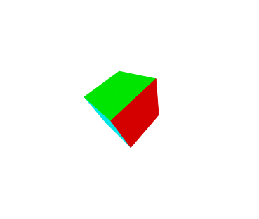

### Mini3D

A graphics engine based on the H5 canvas2d

Mini3D是一个基于H5 canvas2d(未来将支持更多)的3d图形引擎。

## 目前已经完成的部分：

* 正射投影、透视投影摄像机
* 方向光、环境光
* 物体的旋转、偏移、放缩
* 消除隐藏面

## 预计实现的功能：
* 更多的光照效果
* 更多的基本物体模型
* 材质加载与渲染
* 支持使用svg、css、webgl渲染图形
* 加载解析3d模型文件
* ...

ps.本项目的初衷是实践图形学知识，同时也为擅长js的同学学习图形学提供一个关于图形引擎的参考。

