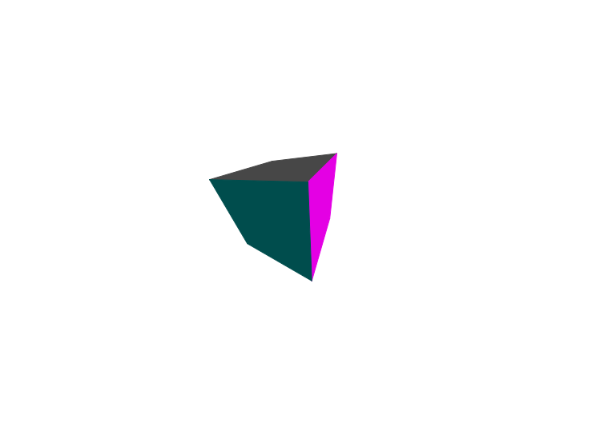

### Mini3D

A graphics engine based on the H5 canvas2d

Mini3D是一个基于H5 canvas2d(未来将支持更多)的3d图形引擎。

|立方体1|立方体2|
| :---: | :---: |
|  |  | 

|球1|球2|
| :---: | :---: |
|  |  | 

## 目前已经完成的部分：

* 正射投影、透视投影摄像机
* 方向光、环境光
* 物体的旋转、偏移、放缩
* 消除隐藏面
* 立方体、球生成算法
* 法线绘制

## 预计实现的功能：
* 更多的光照效果
* 更多的基本物体模型
* 材质加载与渲染
* 支持使用svg、css、webgl渲染图形
* 加载解析3d模型文件
* ...

ps.本项目的初衷是实践图形学知识，同时也为擅长js的同学学习图形学提供一个关于图形引擎的参考。

## 如何使用

本项目依赖sylvester矩阵运算库（因为一共也没用到几个api，有时间考虑去除这个依赖）

```html
<script src="http://cdn.bootcss.com/sylvester/0.1.3/sylvester.min.js"></script>

```

下面通过一段简单的代码创建一个旋转的立方体

```js
let body = document.getElementsByTagName('body')[0];

let Cube = Mini.Shape.Cube;
let Vec3 = Mini.Geometry.Vec3;
let Scence = Mini.Scence;
let Camera = Mini.Camera;
let CameraConfig = Mini.CameraConfig;
let DirectLight = Mini.Light.DirectLight;

let renderer = new Mini.Renderer('canvas',body,700,500);//初始化渲染器
let scence = new Scence();//创建场景
let directLight = new DirectLight(0xffffff,0.7,new Vec3(1,0,0));//创建方向光
scence.add(directLight);
let camera = new Camera(CameraConfig.build('perspective').init());//创建透视照相机，接收视域、宽高比、近平面及远平面4个参数，无参数则使用默认值。
camera.position.set(0,0,-50);
scence.add(camera);
let cube = new Cube(new Vec3(0,0,0),80);//创建立方体，接收位置坐标及尺寸两个参数
scence.add(cube);

animate();

function animate(){
    requestAnimationFrame(animate);
    renderer.render(scence);
    cube.rotY(1).rotX(1);//绕x、y轴进行旋转
}
```

